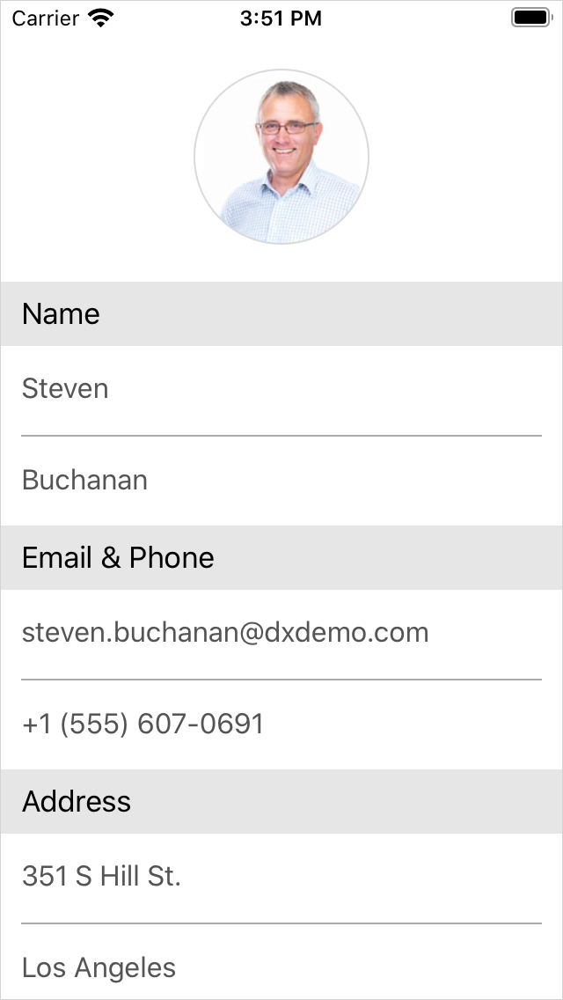

<!-- default file list -->
*Files to look at*:

* [EmployeeInfo.cs](./DataForm_CustomAppearance/EmployeeInfo.cs)
* [EmployeeRepository.cs](./DataForm_CustomAppearance/EmployeeRepository.cs)
* [MainPage.xaml](./DataForm_CustomAppearance/MainPage.xaml)
* [MainPage.xaml.cs](./DataForm_CustomAppearance/MainPage.xaml.cs)
<!-- default file list end -->
# Add a Custom Editor and Change Data Form Appearance

This example demonstrates how to: 
- [create a custom editor on a data form](https://docs.devexpress.com/MobileControls/401776/xamarin-forms/data-form/examples/data-form-custom-editor)
- [customize the data form's appearance](https://docs.devexpress.com/MobileControls/401766/xamarin-forms/data-form/examples/data-form-custom-appearance)

To run the application:
1. [Obtain your NuGet feed URL](http://docs.devexpress.com/GeneralInformation/116042/installation/install-devexpress-controls-using-nuget-packages/obtain-your-nuget-feed-url).
2. Register the DevExpress NuGet feed as a package source.
3. Restore all NuGet packages for the solution.