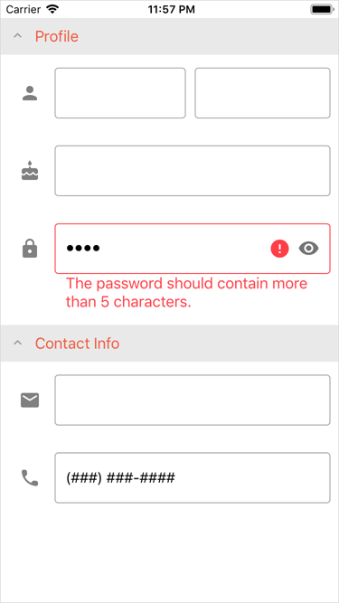

<!-- default file list -->
*Files to look at*:

* [PersonalInfo.cs](./DataForm_GettingStarted/PersonalInfo.cs)
* [MainPage.xaml](./DataForm_GettingStarted/MainPage.xaml)
* [MainPage.xaml.cs](./DataForm_GettingStarted/MainPage.xaml.cs)
<!-- default file list end -->
# Data Form - Getting Started

The example contains the source code of the application created in the [Getting Started](https://docs.devexpress.com/MobileControls/401739/xamarin-forms/data-form/getting-started/index) tutorial. It demonstrates the basic functionality of the DevExpress DataFormView for Xamarin.Forms, and includes the following steps:
- [Set Data Object](https://docs.devexpress.com/MobileControls/401734/xamarin-forms/data-form/getting-started/lesson-1-data-object)
- [Define Editors](https://docs.devexpress.com/MobileControls/401738/xamarin-forms/data-form/getting-started/lesson-2-editors)
- [Specify Form Layout](https://docs.devexpress.com/MobileControls/401741/xamarin-forms/data-form/getting-started/lesson-3-layout)
- [Validate and Commit](https://docs.devexpress.com/MobileControls/401743/xamarin-forms/data-form/getting-started/lesson-4-display-options)

To run the application:
1. [Obtain your NuGet feed URL](http://docs.devexpress.com/GeneralInformation/116042/installation/install-devexpress-controls-using-nuget-packages/obtain-your-nuget-feed-url).
2. Register the DevExpress NuGet feed as a package source.
3. Restore all NuGet packages for the solution.